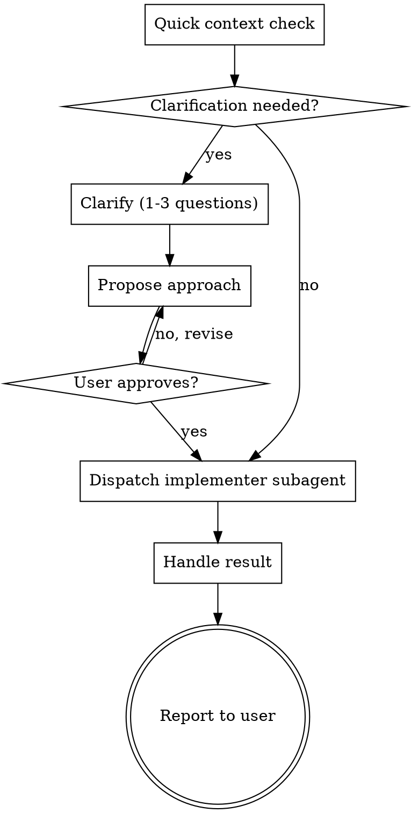

# Chuck: Clarify and Implement

Lightweight collaborative skill for tasks that may benefit from brief clarification before implementation. No plan file — chuck dispatches immediately when the task is clear; when clarification is needed, it asks a few questions, proposes an approach, gets approval, and dispatches an implementer.

<HARD-GATE>
Do NOT start implementing until you have:
1. Asked your clarifying questions (or determined none are needed)
2. If clarification was needed: proposed an approach and received user approval to proceed
</HARD-GATE>

## When to Use

Use chuck when:
- The task is clear or needs brief clarification, but not a full plan
- You could implement it in one focused session
- It touches a handful of files with a clear scope

Use nash + stoudemire instead when:
- The task has multiple independent components
- Architectural decisions have meaningful trade-offs
- You'd need more than 3 questions to understand the requirements

## Checklist

Create a TodoWrite task for each item and complete them in order:

1. **Quick context check** — glance at relevant files/structure
2. **Clarify** — ask 1-3 questions (only if genuinely unclear)
3. **Propose approach** — present one recommendation and get approval (only after clarification)
4. **Dispatch implementer** — fresh subagent with full task context
5. **Handle result** — report back to user

## Process Flow



## The Process

### Phase 1: Quick Context Check

Before asking questions, glance at the relevant parts of the codebase:
- What files/modules are involved?
- What patterns does the existing code use?
- Is there anything that would change your approach?

Keep this fast — 30 seconds of exploration, not 5 minutes of archaeology.

### Phase 2: Clarify

Ask **1-3 questions** to fill genuine gaps. Rules:
- Prefer multiple-choice questions (easier for the user to answer quickly)
- Only ask what you actually need to know to implement well
- If everything is clear from context, skip this phase entirely and say so
- Hard cap: 3 questions. If you need more, the task might be too big (see scope guard below)

### Phase 3: Propose Approach

Only do this phase when you asked clarifying questions.

Present **one recommended approach** in a few sentences:
- What you'll build/change
- Which files you'll touch
- Any trade-offs or assumptions

Ask: "Does this look good?" Wait for approval before proceeding.

### Phase 4: Dispatch Implementer

Launch a fresh subagent with:
- The synthesized task description (from the request and any clarification conversation)
- Relevant context (file paths, patterns, dependencies)
- The no-commit rule
- Self-review instructions

Use the implementer prompt template below.

### Phase 5: Handle Result

Based on the implementer's status:
- **DONE** → run `git diff --stat HEAD`, report summary to user
- **DONE_WITH_CONCERNS** → review concerns; if they affect correctness, address them (re-dispatch or fix directly); if observational, note and report
- **NEEDS_CONTEXT** → provide missing context from your clarification phase, re-dispatch
- **BLOCKED** → escalate to user with what was attempted and what's blocking

## Scope Guard

If during clarification you realize the task:
- Would touch 5+ files across multiple concerns
- Requires multiple independent components
- Needs architectural decisions with meaningful trade-offs

Flag it: "This seems like it might benefit from a full plan. Want me to switch to nash, or should I proceed with chuck?"

Let the user decide. Don't block.

## The No-Commit Rule

Chuck and its implementer subagent MUST NOT commit.

- No `git commit` from the controller (you).
- No `git commit` from the implementer subagent.
- No `git add` followed by commit.
- No amending existing commits.

The human reviews the full diff and commits when ready. If the implementer commits anyway, check `git log` to count the mistaken commits, then soft-reset to undo (`git reset --soft HEAD~N`) and note it in your report.

## Implementer Prompt Template

Use this when dispatching the implementer subagent:

````
```
Task tool (general-purpose):
  description: "Implement: [short task name]"
  prompt: |
    You are implementing a task that was clarified through conversation with the user.

    ## Task

    [Synthesized task description — what to build/change, acceptance criteria,
    files to touch. Write this fresh from the request and any clarification conversation.]

    ## Context

    [Relevant context: file paths, existing patterns, dependencies, anything
    the implementer needs to understand where this fits.]

    ## CRITICAL: Do Not Commit

    You MUST NOT run `git commit`, `git add` followed by commit, `git commit --amend`,
    or any other command that creates or mutates a commit. The human reviews and commits
    everything at the end.

    `git add` to stage files for `git diff --staged` is fine, but never follow it with
    a commit.

    ## Before You Begin

    If you have questions about the requirements, approach, or anything unclear — ask
    them now. It's always OK to pause and clarify.

    ## Your Job

    1. Implement exactly what was described
    2. Write tests if applicable
    3. Verify implementation works (run tests, check for errors)
    4. Do NOT commit — leave changes in the working tree
    5. Self-review (see below)
    6. Report back

    ## Self-Review

    Before reporting, check your work:

    **Completeness:** Did I implement everything described? Missing requirements?
    **Quality:** Clean, maintainable code? Clear names?
    **Discipline:** Only built what was requested? Followed existing patterns?
    **Testing:** Tests verify behavior (not mocks)? Comprehensive?
    **No-commit check:** `git log` shows no new commits from this session.

    Fix any issues found during self-review before reporting.

    ## Report Format

    - **Status:** DONE | DONE_WITH_CONCERNS | BLOCKED | NEEDS_CONTEXT
    - What you implemented
    - Files changed (`git diff --stat HEAD`)
    - Test results (if applicable)
    - Self-review findings (if any)
    - Concerns or blockers (if any)
```
````

## Key Principles

- **Speed over ceremony** — no plan file, no multi-reviewer pipeline
- **Just enough clarification** — 1-3 questions max, skip clarification and approval if clear
- **One approach when needed** — after clarification, propose your best recommendation, not a menu
- **Fresh subagent** — isolate implementation context from clarification context
- **No commits** — human owns the commit history
- **Soft scope guard** — flag when something's too big, but don't block
