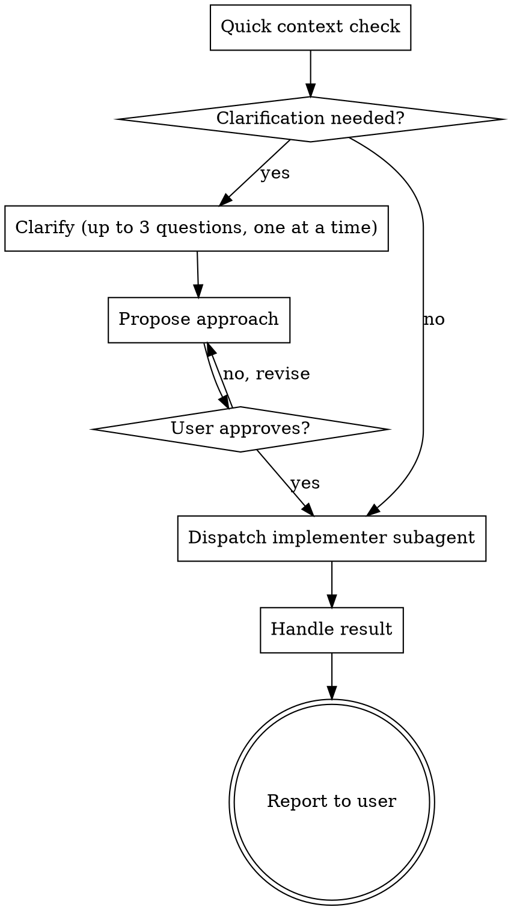

# Chuck: Clarify and Implement

Lightweight collaborative skill for tasks that benefit from brief clarification before implementation. No plan file — chuck is intentionally biased toward pausing for up to 3 quick questions asked one at a time, then proposing an approach, getting approval, and dispatching an implementer. It should dispatch immediately only for truly mechanical, unambiguous tasks.

<HARD-GATE>
Do NOT start implementing until you have:
1. Asked your clarifying questions (or determined none are needed)
2. If clarification was needed: proposed an approach and received user approval to proceed
</HARD-GATE>

## When to Use

Use chuck when:
- The task is clear or needs brief clarification, but not a full plan
- You could implement it in one focused session
- It touches a handful of files with a clear scope

Use nash + stoudemire instead when:
- The task has multiple independent components
- Architectural decisions have meaningful trade-offs
- You'd need more than 3 questions to understand the requirements

## Checklist

Create a TodoWrite task for each item and complete them in order:

1. **Quick context check** — glance at relevant files/structure
2. **Clarify** — ask up to 3 questions by default, one at a time; skip only when the request is truly mechanical and unambiguous
3. **Propose approach** — present one recommendation and get approval whenever you asked questions or made meaningful assumptions
4. **Dispatch implementer** — fresh subagent with full task context
5. **Handle result** — report back to user

## Process Flow


```dot
digraph chuck {
    "Quick context check" [shape=box];
    "Clarification needed?" [shape=diamond];
    "Clarify (up to 3 questions, one at a time)" [shape=box];
    "Propose approach" [shape=box];
    "User approves?" [shape=diamond];
    "Dispatch implementer subagent" [shape=box];
    "Handle result" [shape=box];
    "Report to user" [shape=doublecircle];

    "Quick context check" -> "Clarification needed?";
    "Clarification needed?" -> "Dispatch implementer subagent" [label="no"];
    "Clarification needed?" -> "Clarify (up to 3 questions, one at a time)" [label="yes"];
    "Clarify (up to 3 questions, one at a time)" -> "Propose approach";
    "Propose approach" -> "User approves?";
    "User approves?" -> "Propose approach" [label="no, revise"];
    "User approves?" -> "Dispatch implementer subagent" [label="yes"];
    "Dispatch implementer subagent" -> "Handle result";
    "Handle result" -> "Report to user";
}
```

## The Process

### Phase 1: Quick Context Check

Before asking questions, glance at the relevant parts of the codebase:
- What files/modules are involved?
- What patterns does the existing code use?
- Is there anything that would change your approach?

Keep this fast — 30 seconds of exploration, not 5 minutes of archaeology.

### Phase 2: Clarify

Ask **up to 3 questions by default, one at a time**. Chuck exists because small implementation tasks often hide preference decisions; a 30-second clarification is cheaper than implementing the wrong thing.

Skip clarification only when the request is truly mechanical and unambiguous, such as a precise rename, a specific one-line config change, or an exact bug fix with clear expected behavior. If you are relying on a preference, guessing between multiple reasonable UX/API choices, or assuming scope, ask.

Rules:
- Ask questions **one at a time**
- One question per message — if a topic needs more exploration, break it into multiple questions
- Prefer multiple-choice questions (easier for the user to answer quickly); open-ended is fine too
- Ask about decisions that would change the implementation, user experience, API shape, test strategy, or scope
- Do not ask questions whose answers would not affect your implementation
- If you skip this phase, explicitly state why the task is unambiguous before dispatching
- Hard cap: 3 questions. If you need more, the task might be too big (see scope guard below)

Good clarification targets:
- Desired UX/behavior when there are multiple reasonable options
- Scope boundaries: minimal fix vs broader cleanup, which platforms/routes/files are included
- Compatibility or migration expectations
- Acceptance criteria and testing expectations
- Naming, copy, visual treatment, or API shape when not already established

### Phase 3: Propose Approach

Do this phase whenever you asked clarifying questions or when your implementation depends on meaningful assumptions. If you truly skipped clarification because the task was mechanical and unambiguous, you may dispatch directly.

Present **one recommended approach** in a few sentences:
- What you'll build/change
- Which files you'll touch
- Any trade-offs or assumptions

Ask: "Does this look good?" Wait for approval before proceeding.

### Phase 4: Dispatch Implementer

Launch a fresh subagent with:
- The synthesized task description (from the request and any clarification conversation)
- Relevant context (file paths, patterns, dependencies)
- The no-commit rule
- Self-review instructions

Use the implementer prompt template below.

### Phase 5: Handle Result

Based on the implementer's status:
- **DONE** → run `git diff --stat HEAD`, report summary to user
- **DONE_WITH_CONCERNS** → review concerns; if they affect correctness, address them (re-dispatch or fix directly); if observational, note and report
- **NEEDS_CONTEXT** → provide missing context from your clarification phase, re-dispatch
- **BLOCKED** → escalate to user with what was attempted and what's blocking

## Scope Guard

If during clarification you realize the task:
- Would touch 5+ files across multiple concerns
- Requires multiple independent components
- Needs architectural decisions with meaningful trade-offs

Flag it: "This seems like it might benefit from a full plan. Want me to switch to nash, or should I proceed with chuck?"

Let the user decide. Don't block.

## The No-Commit Rule

Chuck and its implementer subagent MUST NOT commit.

- No `git commit` from the controller (you).
- No `git commit` from the implementer subagent.
- No `git add` followed by commit.
- No amending existing commits.

The human reviews the full diff and commits when ready. If the implementer commits anyway, check `git log` to count the mistaken commits, then soft-reset to undo (`git reset --soft HEAD~N`) and note it in your report.

## Implementer Prompt Template

Use this when dispatching the implementer subagent:

````
```
Task tool (general-purpose):
  description: "Implement: [short task name]"
  prompt: |
    You are implementing a task that was clarified through conversation with the user.

    ## Task

    [Synthesized task description — what to build/change, acceptance criteria,
    files to touch. Write this fresh from the request and any clarification conversation.]

    ## Context

    [Relevant context: file paths, existing patterns, dependencies, anything
    the implementer needs to understand where this fits.]

    ## CRITICAL: Do Not Commit

    You MUST NOT run `git commit`, `git add` followed by commit, `git commit --amend`,
    or any other command that creates or mutates a commit. The human reviews and commits
    everything at the end.

    `git add` to stage files for `git diff --staged` is fine, but never follow it with
    a commit.

    ## Before You Begin

    If you have questions about the requirements, approach, or anything unclear — ask
    them now. It's always OK to pause and clarify.

    ## Your Job

    1. Implement exactly what was described
    2. Write tests if applicable
    3. Verify implementation works (run tests, check for errors)
    4. Do NOT commit — leave changes in the working tree
    5. Self-review (see below)
    6. Report back

    ## Self-Review

    Before reporting, check your work:

    **Completeness:** Did I implement everything described? Missing requirements?
    **Quality:** Clean, maintainable code? Clear names?
    **Discipline:** Only built what was requested? Followed existing patterns?
    **Testing:** Tests verify behavior (not mocks)? Comprehensive?
    **No-commit check:** `git log` shows no new commits from this session.

    Fix any issues found during self-review before reporting.

    ## Report Format

    - **Status:** DONE | DONE_WITH_CONCERNS | BLOCKED | NEEDS_CONTEXT
    - What you implemented
    - Files changed (`git diff --stat HEAD`)
    - Test results (if applicable)
    - Self-review findings (if any)
    - Concerns or blockers (if any)
```
````

## Key Principles

- **Speed over ceremony** — no plan file, no multi-reviewer pipeline
- **Clarification bias** — ask up to 3 questions by default, one at a time; skip only for truly mechanical, unambiguous work
- **One approach when needed** — after clarification, propose your best recommendation, not a menu
- **Fresh subagent** — isolate implementation context from clarification context
- **No commits** — human owns the commit history
- **Soft scope guard** — flag when something's too big, but don't block
