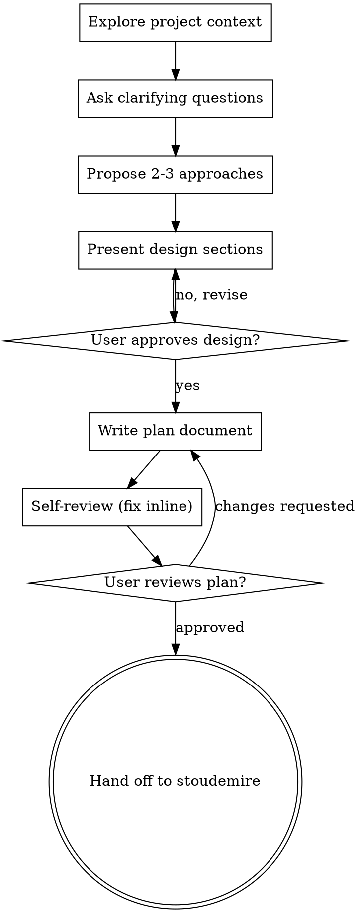

# Nash: Brainstorm and Plan

Turn an idea into a single, fully-formed implementation plan through collaborative dialogue. Nash combines brainstorming with plan-writing — one skill, one output document.

<HARD-GATE>
Do NOT write any code, scaffold any project, or take any implementation action until you have presented a design, the user has approved it, and you have written the plan document. This applies to EVERY project regardless of perceived simplicity.
</HARD-GATE>

## Output

A single plan document at `plans/YYYY-MM-DD-<topic>-plan.md`. This is the only artifact — no separate spec file. The plan is what stoudemire (or a human) executes against.

## Checklist

Create a TodoWrite task for each item and complete them in order:

1. **Explore project context** — check files, docs, recent commits
2. **Ask clarifying questions** — one at a time; understand purpose, constraints, success criteria
3. **Propose 2-3 approaches** — with trade-offs and your recommendation
4. **Present design** — in sections scaled to complexity, get user approval
5. **Write plan document** — save to `plans/YYYY-MM-DD-<topic>-plan.md`
6. **Self-review the plan** — fix placeholders, contradictions, ambiguity, scope, type consistency
7. **User reviews the plan** — wait for approval before handing off

## Process Flow



## The Process

### Understanding the idea

- Check the current project state first (files, docs, recent commits).
- Assess scope before drilling into details: if the request describes multiple independent subsystems (e.g., "build a platform with chat, file storage, billing, and analytics"), flag this immediately. Help the user decompose into sub-projects, then plan the first sub-project. Each sub-project gets its own plan.
- For appropriately-scoped projects, ask questions **one at a time**.
- Prefer multiple choice questions when possible; open-ended is fine too.
- One question per message — if a topic needs more exploration, break it into multiple questions.
- Focus on understanding: purpose, constraints, success criteria.

### Exploring approaches

- Propose 2-3 different approaches with trade-offs.
- Lead with your recommended option and explain why.
- Present conversationally, not as a wall of bullets.

### Presenting the design

- Once you understand what you're building, present the design.
- Scale each section to its complexity: a few sentences if straightforward, up to 200-300 words if nuanced.
- Cover: architecture, components, data flow, error handling, testing.
- Ask after each section whether it looks right.
- Be ready to go back and clarify if something doesn't make sense.

### Design for isolation and clarity

- Break the system into smaller units that each have one clear purpose, communicate through well-defined interfaces, and can be understood and tested independently.
- For each unit, you should be able to answer: what does it do, how do you use it, what does it depend on?
- Smaller, well-bounded units are easier to reason about and easier to edit reliably. Large files are usually a signal of doing too much.

### Working in existing codebases

- Explore the current structure before proposing changes. Follow existing patterns.
- Where existing code has problems that affect the work, include targeted improvements as part of the plan — the way a good developer improves code they're working in.
- Don't propose unrelated refactoring. Stay focused on the current goal.

## Writing the Plan

After the user approves the design, write a single plan document at `plans/YYYY-MM-DD-<topic>-plan.md`.

### Plan Header

Every plan MUST start with this header:

```markdown
# [Feature Name] Plan

> **For agentic workers:** Use the `stoudemire` skill to execute this plan task-by-task. Steps use checkbox (`- [ ]`) syntax for tracking. **Do not commit during execution** — the human reviews and commits all work after stoudemire is done.

**Goal:** [One sentence describing what this builds]

**Architecture:** [2-3 sentences about the approach]

**Tech Stack:** [Key technologies/libraries]

## Design

[The validated design from brainstorming. Include architecture, components, data flow, error handling, testing strategy. This replaces a separate spec — the design lives inside the plan.]

## File Structure

[Map of files to create/modify and what each is responsible for. This locks in the decomposition.]

---
```

### Task Structure

Each task is a self-contained chunk of work with bite-sized steps (2-5 minutes each). **Do not include commit steps** — the human commits after the entire plan is executed.

````markdown
### Task N: [Component Name]

**Files:**
- Create: `exact/path/to/file.ext`
- Modify: `exact/path/to/existing.ext:123-145`
- Test: `tests/exact/path/to/test.ext`

- [ ] **Step 1: Write the failing test**

```ts
test('specific behavior', () => {
  const result = fn(input);
  expect(result).toBe(expected);
});
```

- [ ] **Step 2: Run test to verify it fails**

Run: `npm test -- tests/path/test.ts`
Expected: FAIL with "fn is not defined"

- [ ] **Step 3: Write minimal implementation**

```ts
export function fn(input: string) {
  return expected;
}
```

- [ ] **Step 4: Run test to verify it passes**

Run: `npm test -- tests/path/test.ts`
Expected: PASS
````

**Notes on task structure:**
- No commit steps. Stoudemire and the implementer subagents will not commit. The human reviews the entire diff at the end.
- Use TDD: failing test → run → minimal implementation → run.
- Each task should produce changes that make sense as a single logical unit.

### No Placeholders

Every step must contain the actual content an engineer needs. These are **plan failures** — never write them:

- "TBD", "TODO", "implement later", "fill in details"
- "Add appropriate error handling" / "add validation" / "handle edge cases"
- "Write tests for the above" (without actual test code)
- "Similar to Task N" (repeat the code — the engineer may read tasks out of order)
- Steps that describe what to do without showing how (code blocks required for code steps)
- References to types, functions, or methods not defined in any task

## Self-Review

After writing the plan, look at it with fresh eyes:

1. **Placeholder scan** — any "TBD", "TODO", incomplete sections, or vague requirements? Fix them.
2. **Internal consistency** — do sections contradict each other? Does the file structure match the tasks?
3. **Type consistency** — do types, method signatures, and property names in later tasks match earlier ones? `clearLayers()` in Task 3 but `clearFullLayers()` in Task 7 is a bug.
4. **Scope check** — is this focused enough for one execution pass, or does it need decomposition?
5. **Ambiguity check** — could any requirement be interpreted two ways? Pick one and make it explicit.
6. **No commit steps** — confirm no task includes `git commit`. The human commits after execution.

Fix any issues inline. No need to re-review — just fix and move on.

## User Review Gate

After self-review, ask the user to review the plan:

> "Plan written and saved to `plans/<filename>.md`. Please review it and let me know if you want to make any changes before we hand off to stoudemire."

Wait for the user's response. If they request changes, make them and re-run self-review. Only proceed once approved.

## Handoff

Once the plan is approved, offer the next step:

> "Plan approved. Ready to execute? Use the `stoudemire` skill to dispatch implementer subagents per task. Stoudemire will not commit — you'll review the full diff at the end."

## Key Principles

- **One question at a time** — don't overwhelm
- **Multiple choice preferred** — easier than open-ended when possible
- **YAGNI ruthlessly** — remove unnecessary features
- **Explore alternatives** — propose 2-3 approaches before settling
- **Single output** — one plan file, no separate spec
- **No commits in the plan** — the human reviews and commits after execution
