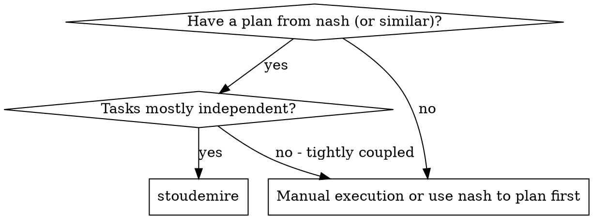
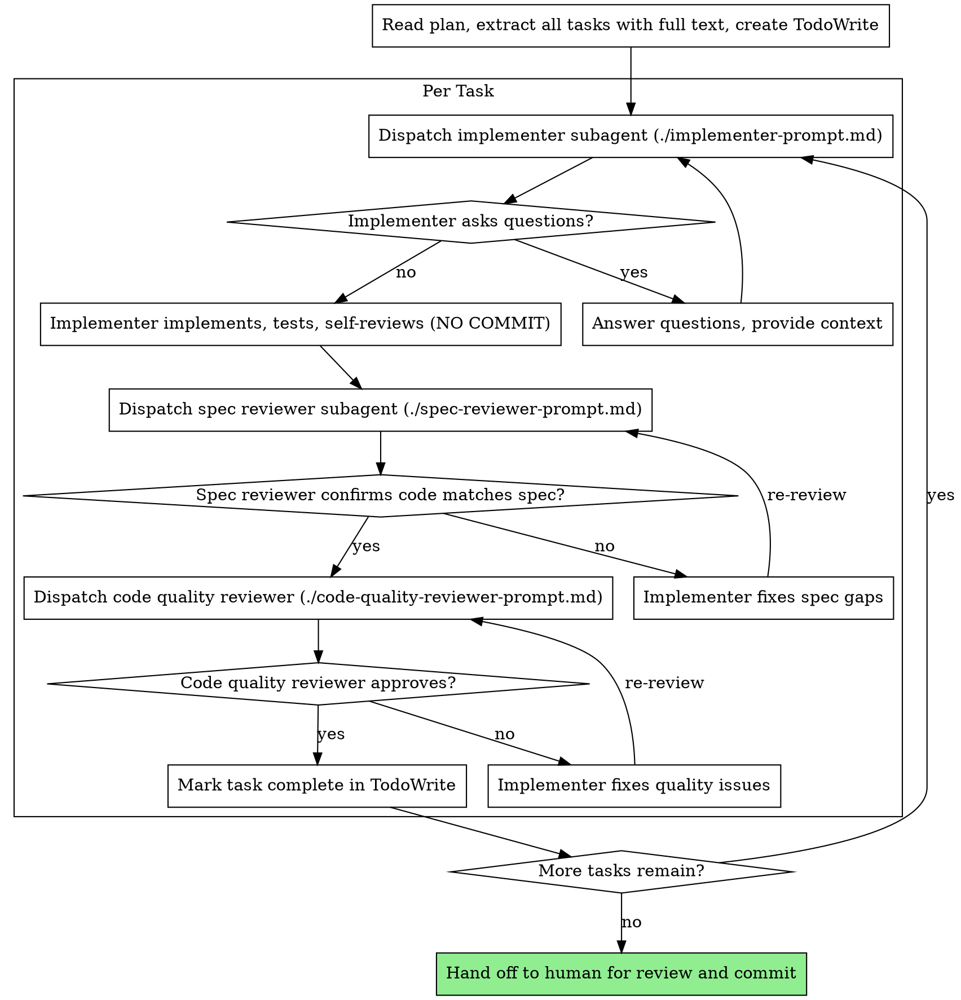

# Stoudemire: Subagent-Driven Execution (No Commits)

Execute a plan by dispatching a fresh subagent per task, with two-stage review after each: spec compliance first, then code quality. **No commits happen during execution.** When all tasks are done, you hand the working tree back to the human, who reviews the full diff and commits.

**Why subagents:** You delegate tasks to specialized agents with isolated context. By precisely crafting their instructions and context, you ensure they stay focused and succeed. They never inherit your session's context — you construct exactly what they need. This also preserves your own context for coordination.

**Core principle:** Fresh subagent per task + two-stage review (spec then quality) + no commits = high quality, fast iteration, human-controlled history.

**Continuous execution:** Do not pause to check in with your human partner between tasks. Execute all tasks without stopping. The only reasons to stop are: BLOCKED status you cannot resolve, ambiguity that genuinely prevents progress, or all tasks complete. "Should I continue?" prompts waste their time — they asked you to execute, so execute.

## The No-Commit Rule

**Stoudemire and every subagent it dispatches MUST NOT commit.**

- No `git commit` from the controller.
- No `git commit` from any implementer subagent.
- No `git add` followed by commit.
- No amending existing commits.
- No creating branches with the intent to merge.

The working tree accumulates all changes across all tasks. When you finish, the human gets a single, reviewable diff that they decide how to commit (one commit, many commits, squash — their choice).

If a plan task includes a commit step, **skip the commit step** and proceed to the next non-commit step. Note in your task report that the commit step was skipped per the no-commit rule.

## When to Use

## The Process

## Setup: Read the Plan Once

Before dispatching anything:

1. Read the plan file once.
2. Extract every task with its **full text** (don't make subagents re-read the plan).
3. Note overall context: goal, architecture, file structure.
4. Create a TodoWrite with one item per task.
5. Confirm `git status` shows a clean working tree (or note any pre-existing changes the user wants kept).

## Model Selection

Use the least powerful model that can handle each role to conserve cost and increase speed.

- **Mechanical tasks** (1-2 files, clear spec): cheap/fast model.
- **Integration / judgment tasks** (multi-file, pattern matching, debugging): standard model.
- **Architecture / final review**: most capable model.

## Handling Implementer Status

Implementer subagents report one of four statuses:

- **DONE** — proceed to spec compliance review.
- **DONE_WITH_CONCERNS** — read concerns first. If they affect correctness/scope, address before review. If observational, note and proceed.
- **NEEDS_CONTEXT** — provide the missing context and re-dispatch.
- **BLOCKED** — assess: provide more context? re-dispatch with stronger model? break the task up? escalate to human?

**Never** ignore an escalation or force the same model to retry without changes.

## Prompt Templates

- `./implementer-prompt.md` — implementer subagent
- `./spec-reviewer-prompt.md` — spec compliance reviewer
- `./code-quality-reviewer-prompt.md` — code quality reviewer

All three templates include explicit "do not commit" instructions.

## Final Handoff

After every task is approved by both reviewers:

1. Run `git status` and `git diff --stat` to summarize changes.
2. Report to the human:

> "All N tasks complete. Working tree has uncommitted changes across [X] files. Please review the diff and commit when ready. I have not committed anything per the no-commit rule."

3. Do **not** commit. Do **not** suggest a commit message unless asked. The human owns the commit history.

## Red Flags

**Never:**
- Commit, amend, stash-and-pop-with-commit, or otherwise mutate git history during execution
- Skip reviews (spec compliance OR code quality)
- Proceed with unfixed issues
- Dispatch multiple implementer subagents in parallel (conflicts on the working tree)
- Make a subagent read the plan file (provide full text instead)
- Skip scene-setting context (subagent needs to understand where the task fits)
- Ignore subagent questions (answer before letting them proceed)
- Accept "close enough" on spec compliance
- Start code quality review before spec compliance is ✅ (wrong order)
- Move to the next task while either review has open issues

**If a subagent commits anyway:** soft-reset to undo the commit while preserving the working tree changes (`git reset --soft HEAD~N`), then continue. Note the incident in the final handoff.

## Integration

- **Upstream:** `nash` produces the plan this skill executes.
- **Downstream:** The human reviews and commits. No automated finishing skill runs.
